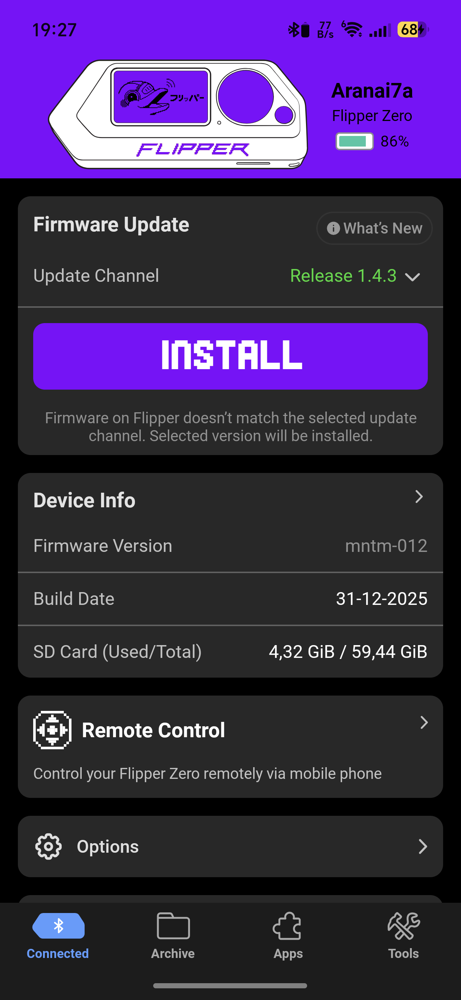
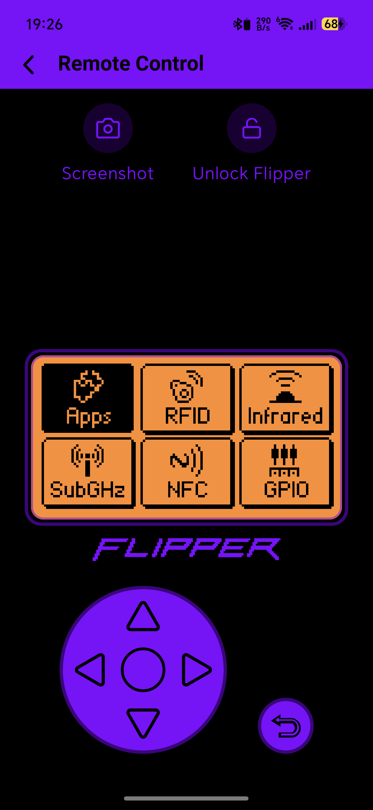

# Flipper Android App — Custom Theme Edition

A fork of the official [Flipper Devices Android app](https://github.com/flipperdevices/Flipper-Android-App) with a **global custom accent color** feature added — pick any color via a Hue/Saturation/Brightness picker (with presets and a separate D-Pad slider) and the whole app re-themes live, including the D-Pad, buttons, top bars, the Remote Control screen, the Device Info mockup illustration, and the simulated hardware display.


| Device Info screen | Remote Control screen |
| --- | --- |
|  |  |

## What's new

- **Settings → Custom Theme**: a bottom-sheet-style color picker with 12 preset swatches plus Hue / Saturation / Brightness sliders and an independent D-Pad hue slider, Reset and Done.
- The chosen color persists across restarts (stored alongside the app's other settings) and animates smoothly (750ms) wherever it's applied.
- Recolored surfaces: primary buttons, switches, tab bar, text selection, top app bars across every screen, the Screen Streaming D-Pad (fill + outline) and its Return button, the Remote Control screen's navigation buttons, the "FLIPPER" wordmark, the Device Info mockup illustration (all three hardware body colors: White/Black/Transparent), and the simulated Flipper LCD background.
- Deliberately left alone: the physical device's actual case color in the mockup, and the per-protocol category colors (NFC/RFID/SubGHz/etc. each keep their own identity color so they stay visually distinguishable). The home-screen launcher icon is also unchanged — recoloring that would need a completely different mechanism (pre-baked alternate icons swapped via `activity-alias`), out of scope here.

## Download

A pre-built debug APK is attached to this repo's [Releases](../../releases) page.

For the official, unmodified app, see [upstream's Google Play / F-Droid links](https://github.com/flipperdevices/Flipper-Android-App#download).

## Building

This is the same multi-module Gradle/Kotlin Multiplatform project as upstream. You'll need Android Studio (or the Android SDK + a JDK) with `compileSdk 36`.

```
git clone <this repo>
cd Flipper-Android-App-dev
./gradlew :instances:android:app:assembleDebug
```

The debug APK lands at `instances/android/app/build/outputs/apk/debug/app-debug.apk`.

### Note on vendored protobuf schemas

`components/bridge/pbutils/src/main/proto`, `components/analytics/metric/impl/src/main/proto`, and `components/nfc/tools/impl/src/main/cpp/nfc-tools` are normally git submodules pointing at Flipper's [flipperzero-protobuf](https://github.com/flipperdevices/flipperzero-protobuf), [flipperzero-protobuf-metric](https://github.com/flipperdevices/flipperzero-protobuf-metric), and [flipperzero-nfc-tools](https://github.com/flipperdevices/flipperzero-nfc-tools) repos. Here they're vendored in directly (flattened, not submodules) because the vendored `.proto` files use a Doxygen comment style (`/**< ... */`) that the pinned Wire compiler version can't parse — the trailing/multi-line comments were mechanically converted to `//` line comments (no field/message changes) so the project builds out of the box.

## Module arch

```
├── instances
│   ├── app
├── components
│   ├── core
│   ├── bridge
│   ├── feature1
│   ├── feature2
```

- `app` - Main application module with UI
- `components/core` - Core library with deps and utils
- `components/bridge` - Communication between android and Flipper
- `components/*` - Features modules, which connect to root application

## License

The app itself is MIT-licensed (see [LICENSE](LICENSE)), same as upstream. The vendored `nfc-tools` code under `components/nfc/tools/impl/src/main/cpp/nfc-tools` is GPLv3-licensed by its original authors.
